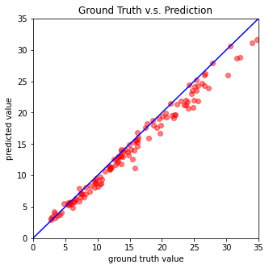

# Regression : COVID-19 Cases Prediction

## Adjust : 
* Training Data
* Model
* Optimizer
* Regularization
* Batch Size
* Feature Select

### (1) Training Data : 
9:1 -> 14:1
|          | Training Data | Valid Data |
|:--------:|:-------------:|:----------:|
| Original |     2430      |    270     |
|   New    |     2520      |    180     |

### (2) Model : 
* Hidden layer neuro : 64 -> 128
* Add Batch Normalization

### (3) Optimizer : 
* SGD -> Adam

### (4) Regularization : 
* Add L2 Regularization : weight_decay = 0.01

### (5) Batch Size : 
* 270 -> 128

### (6) Feature Select(Important) : 
Use f_regression of sklearn to select the top 15% relevant features.

* Input
```
# Select Feature
selector = SelectPercentile(score_func=f_regression, percentile=15)

# Get the Appropriate Features
selector.fit(data, target)

# Get a mask, or integer index, of the features selected.
Feature_Position = selector.get_support(True)
```

* Output
Use these features to train the model
```
# Features selected by f_regression
[40, 41, 42, 43, 57, 58, 59, 60, 61, 75, 76, 77, 78, 79]
```

## Result : 
### Loss : 
It doesn't run 3000 epoch because early stop.


### Learning Curve : 


### Prediction : 


### Kaggle Score : 

| Baseline | Public  | Private |
|:--------:|:-------:|:-------:|
|  Strong  | 0.88017 | 0.89266 |
|  Medium  | 1.28359 | 1.36937 |

## Conclusion : 
Feature Selecteion has the best effect among all adjustments. I found it is better without normalization. I think it's because normalization is not added when selecting feature. I will do the test afterwards.

## Reference : 
* [Lemontree YC : Discussion of Strong Baseline](https://www.kaggle.com/c/ml2021spring-hw1/discussion/264579)
