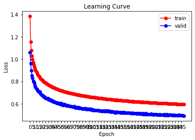
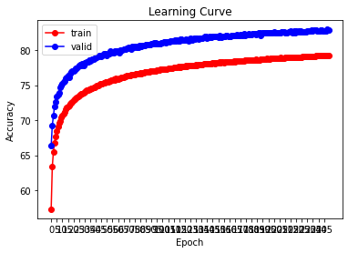

# Classification : TIMIT Framewise Phoneme

### (1) Model : 
* 一開始只有建 2 層的簡單模型，觀察訓練狀況，慢慢往上加深，隨著層數往上會開始出現 Overfitting，因此把神經元減少，加入 Dropout 後能觀察到 Training Loss 跟 Valid Loss 保持差不多的斜率下降。

### (2) Regularization : 
* 發現不論 weight_decay 調多少，都訓練不太動， 因此沒加入 Regularization

### (3) Batch Size : 
* Batch = 64 是效果最好的(試過 32、64、128)

### (4) Ensemble Learning : 

* 將多個訓練完的模型結合，共同決定預測值
* EX : 有一筆資料真實值為 1，總共使用 **3 個模型**進行預測，其中 **1 個模型預測為 0**，另外 **2 個模型預測為 1**，那我們將會認為這筆資料值為 1

|  Model  | Predict |
|:-------:|:-------:|
| Model 1 |    1    |
| Model 2 |    1    |
| Model 3 |    0    |

## Result : 
* 此為 model_6 的結果，圖片沒設定好 XD，這裡應該是 250 個 Epoch
### Loss : 

### Accuracy : 

### Kaggle Score : 

**(1) Official :**

| Baseline | Public  | Private |
|:--------:|:-------:|:-------:|
|  Strong  | 0.76023 | 0.76118 |
|  Simple  | 0.68334 | 0.68561 |

**(2) My Work :**

|      Model      |   Public    |   Private   |
|:---------------:|:-----------:|:-----------:|
|     model_1     |   0.73703   |   0.73508   |
|     model_3     |   0.74603   |   0.74447   |
|     model_6     |   0.74745   |   0.74541   |
|     model_7     |   0.73300   |   0.73286   |
| **Final model** | **0.75747** | **0.75603** |

## Conclusion : 
這次是從 Public Score 等於 0.68084 開始，慢慢修改模型，每次都確定結果有上升才繼續改模型及參數，最好達到約 0.74 左右時偶然看到 pai4451 這位大大的方法，使用了 Ensemble 後達到了 Public = 0.75747 與 Private 0.75603，離 Strong Baseline 差了一點，之後有機會再來修改模型吧。

## Reference : 
[參考：pai4451 Github](https://github.com/pai4451/ML2021/tree/main/hw2)
