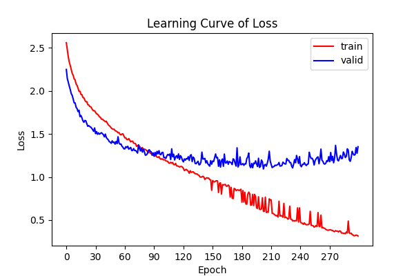
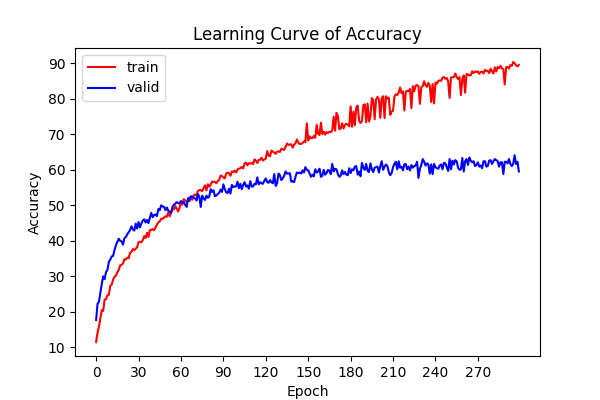
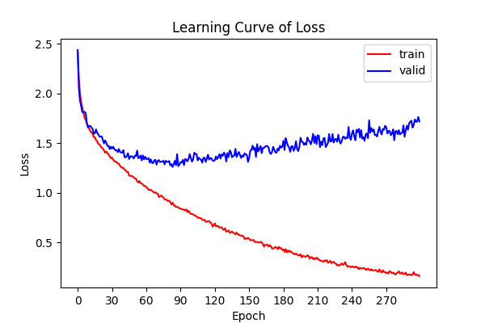
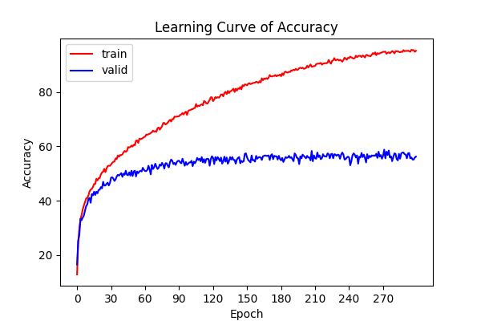

# Convolutional Neural Network - Image Classfication

## (1) Hyperparameter : 
### My Model
|               | Value |
|:-------------:|:-----:|
| Learning Rate | 1e-5  |
|  Image Size   |  128  |
|  Batch Size   |  128  |
|     Epoch     |  300  |
| Weight Decay  | 1e-4  |

### Resnet18
|               | Value |
|:-------------:|:-----:|
| Learning Rate | 1e-5  |
|  Image Size   |  224  |
|  Batch Size   |  128  |
|     Epoch     |  300  |
| Weight Decay  | 1e-4  |

## (2) Result
### 1. My Model: 
#### Loss : 

#### Accuracy : 

### 2. Resnet18: 
#### Loss : 

#### Accuracy : 

## (3) Kaggle Score : 

**(1) Official :**

| Baseline | Public | Private |
|:--------:|:------:|:-------:|
|  Strong  | 82.138 | 81.410  |
|  Medium  | 52.807 | 54.393  |
|   Easy   | 44.862 | 47.220  |

**(2) My Work :**

|      Model      | Public | Private |
|:---------------:|:------:|:-------:|
|    My Model     | 62.126 | 62.701  |
|    Resnet18     | 55.734 | 54.991  |

## Conclusion : 
### 1. Model : 
原本是透過自己建的 model 來進行訓練，後來嘗試使用 Resnet18 (Pretrained = False)，發現結果並沒有更好，應該是因為訓練資料太少，而 model 太複雜了，最後還是使用自己建的 model 來訓練。

### 2. Data Augmentation
在一開始嘗試只修改模型，但發現基本上是訓練不起來的，Valid Loss 很難下降，所以就使用一些資料擴增方法，首先將所有圖片水平翻轉並存到訓練集，因此就有2倍的資料量，接著在訓練時進行旋轉、縮放、亮度等等，可以發現效果確實好了不少，不過仍然不太好訓練。

### 3. Semi-Supervised Learning :
1. 因為訓練資料實在是有點少，也就要用到 Training Data 中的 Unlabeled Data 進行訓練，不過這部分的不太好寫，參考了網上的方式改寫了一下。
2. 我將閥值調至 0.9 並且當 Valid Accuracy > 60% 才加入 Unlabeled Data 訓練，但因為原本訓練集太少所以很難在前期達到 Valid Accuracy > 60%，大約到 epoch = 150 時才開始使用，第一次使用了 1274 筆，訓練到後期最多使用到 4024 筆，Valid Accuracy 最高達到 64%，最後 Private Score 達到 62.701 %。
3. 同樣的訓練資料下，除了 input size 為 (224, 224)，Resnet18 無法在 Valid Accuracy 上達到 60%，以致於沒有使用到任何 Unlabeled Data 進行訓練，在 Kaggle 上的分數也明顯看出泛化性並不是很好
### 4. 問題：
Valid Accuracy 大致上到 60% 附近時就已經 Overfitting，沒有再往上升，Valid Loss 也開始不降反升。要再把模型簡化或是進行其他 Data Augmentation。

## Reference : 
[參考：Francis Komizu 知乎](https://zhuanlan.zhihu.com/p/436809552)
